# PFE-SENTINEL (ETAP) — Rapport A->Z (fonctionnel + technique)

Document base sur le code du depot `C:\PFE-SENTINEL` (frontend React, backend Node/Express, MongoDB, Redis optionnel, IA Python + Gemini optionnel).

Confidentialite: ce rapport ne recopie pas les valeurs sensibles de `.env` (uniquement les noms de variables quand necessaire).

## Sommaire
- 1) Idee / pitch
- 2) Acteurs
- 3) Architecture
- 4) Besoins fonctionnels
- 5) Besoins non fonctionnels
- 6) Modele de donnees (collections + champs)
- 7) Workflows (par acteur/mouvement)
- 8) Diagrammes (use case + classes + sequences/activites par sprint)
- 9) Backlog global + sprints
- 10) Contradictions / incoherences (rapport dedie)

---

## 1) Idee de l'application (pitch)

SENTINEL est une application web de gestion de stock orientee:
- processus (demandes, validations, inventaires, commandes),
- tracabilite (historique metier immuable + audit securite),
- operations (FIFO lots, QR, bons internes),
- aide a la decision (alertes, predictions, copilote, chatbot Responsable).

Objectif PFE: demontrer une solution realiste de bout en bout (front + back + donnees + audit + IA) sur un contexte ETAP (incluant un scenario "petrole").

---

## 2) Acteurs (humains + systemes)

### Acteurs humains
- Demandeur
  - consulte le catalogue (produits approuves),
  - cree des demandes,
  - confirme la reception apres service.
- Magasinier
  - gere produits, entrees/sorties stock,
  - execute les demandes (preparer/servir),
  - gere les sessions d'inventaire (comptage + cloture),
  - utilise le centre d'actions (inbox).
- Responsable
  - valide/rejette produits et pilote les seuils/alertes,
  - gere categories, utilisateurs, fournisseurs, commandes,
  - applique les inventaires,
  - utilise l'assistant IA (chat/mini-rapport + voix).

### Acteurs systemes / dependances
- Backend Node/Express (API, RBAC, sessions, queue mail, IA)
- MongoDB (collections)
- Redis (optionnel, recommande pour la queue mail)
- Python (optionnel en local, inclus dans Docker backend) pour IA locale
- Gemini (optionnel) pour generation + transcription audio
- SMTP (optionnel) pour emails; Twilio (optionnel) pour SMS/WhatsApp

---

## 3) Architecture (vue globale)

### 3.1 Frontend (React)
- Routage par role dans `src/App.js`:
  - demandeur: `/demandeur`, `/demandeur/mes-demandes`
  - magasinier: `/magasinier`, `/magasinier/inbox`, `/magasinier/demandes`, `/magasinier/entree-stock`, `/magasinier/sortie-stock`, `/magasinier/inventaire`, `/magasinier/chat`, etc.
  - responsable: `/responsable`, `/responsable/pilotage`, `/responsable/transactions`, `/responsable/inventaires`, `/responsable/chatbot`, `/responsable/parametres`, etc.
- Client API centralise `src/services/api.js`:
  - ajoute `Authorization: Bearer`,
  - fait `/auth/refresh` sur 401,
  - cache certains GET (TTL) + metriques perf.

### 3.2 Backend (Node/Express + Mongo)
- Serveur: `backend/server.js`
- DB: `backend/db.js`
- Middlewares:
  - `requireAuth`: JWT + session DB + inactivite
  - `requirePermission`: RBAC
  - `idempotencyGuard`: anti-doublons
  - rate limiting: auth/ai/chat
- Routes principales:
  - `/api/auth`, `/api/products`, `/api/categories`, `/api/stock`, `/api/requests`, `/api/history`
  - `/api/chat`, `/api/ai`, `/api/inventory`, `/api/suppliers`, `/api/purchase-orders`
  - `/api/settings`, `/api/security-audit`, `/api/notifications`, `/api/files`, `/api/reports`, `/api/feed`

### 3.3 IA (hybride)
- Node: `backend/services/aiModelService.js` (spawn Python + cache + fallback)
- Python: `backend/ai_py/*.py` (features, evaluation, predictions, copilote, assistant)
- Gemini: `backend/services/geminiService.js` (optionnel)

### 3.4 API endpoints (principaux, non exhaustif)

Auth (`/api/auth`)
- `POST /login`
- `POST /refresh`
- `POST /logout`, `POST /logout-refresh`, `POST /logout-all`
- `POST /forgot-password/request|verify|reset`

Stock (`/api/stock`)
- `GET /entries`, `GET /exits`
- (metier) creation entree/sortie FIFO + annulation (cancel)
- `GET /fifo/next-lot/:productId`
- `GET /kpis` (lecture KPI/historique)
- (bon interne) generation/resolve/print (selon routes)

Demandes (`/api/requests`)
- `GET /` (filtre status), `GET /:id`
- Actions: validate/prepare/serve/cancel/confirm-receipt (selon droits)

IA (`/api/ai`)
- Status: `GET /assistant/status`, `GET /python/status`, `GET /gemini/status`
- Models: `GET /models/status|metrics|backtesting|versions`, `POST /models/train`
- Predict: `POST /predict/stockout|consumption|anomaly`
- Copilot: `POST /copilot/recommendations`, `POST /copilot/apply`, `GET /copilot/applied`
- Assistant: `POST /assistant/ask`, `POST /assistant/transcribe`, `POST /assistant/voice-ask`, `GET /assistant/traces`
- Inbox: `GET /magasinier-inbox`, `POST /magasinier/decision-done`

Inventaire (`/api/inventory`)
- `GET /sessions`, `POST /sessions`, `GET /sessions/:id`
- `POST /sessions/:id/count`, `POST /sessions/:id/close`, `POST /sessions/:id/apply`

Commandes (`/api/purchase-orders`) + fournisseurs (`/api/suppliers`)
- PO: list, quick create, receive, status update
- Supplier: CRUD + links products (selon routes)

---

## 4) Besoins fonctionnels (synthese)

### Auth / sessions
- Login multi-identifiant (email/username/telephone)
- JWT access court + refresh token
- Sessions DB revocables + inactivite
- Mot de passe oublie (OTP) via email/SMS/WhatsApp

### Stock & catalogue
- Produits: creation magasinier, validation responsable, archivage
- Categories: audiences (profils demandeur)
- Entrees stock: documents + lots + pieces jointes
- Sorties FIFO: consommation lots + controle QR + bon interne signe

### Processus
- Demandes: pending -> validated -> preparing -> served -> received (+ rejected/cancelled)
- Notifications in-app + email selon preferences
- Chat direct + threads contextualises
- Fournisseurs + commandes + reception (cree entrees/lots)
- Inventaires: comptage magasinier + application responsable (ajustements)

### IA & decision
- Dashboard responsable (alertes, tendances)
- Copilote: actions recommandees, simulations de commande, heatmap criticite
- Assistant Responsable: chat/report + voix + traces

---

## 5) Besoins non fonctionnels (NFR)

### Securite / conformite
- RBAC par permissions (`backend/constants/permissions.js`)
- CORS configure + Helmet
- Rate limiting (auth/ai/chat)
- QR tokens signes avec secret dedie exige en production
- Audit securite (`SecurityAudit`) avec masquage/hachage email

### Robustesse / qualite
- `History` append-only (verrouillage update/delete)
- Transactions Mongo avec fallback si Mongo standalone
- Idempotence (`IdempotencyKey` avec TTL)
- Fallback IA si Python/Gemini indisponible

### Exploitation
- `/api/health` (mongo + smtp + queue + secret QR)
- Logs structures
- Metriques perf API cote frontend

---

## 6) Modele de donnees (collections MongoDB + champs)

Note: dans cette application, les "tables" correspondent a des **collections** MongoDB (Mongoose). Les liens se font via `ObjectId` + `ref`.

### 6.1 Noyau stock

**Product (produits)**
- Identite: `code_product` (unique, uppercase), `name`, `description`
- Classification: `family` (economat|produit_chimique|gaz|consommable_laboratoire), `unite`, `emplacement`, `chemical_class`, `physical_state`
- Categorie: `category` (ref Category, optionnel) + `category_proposal`
- Documents: `fds_attachment{file_name,file_url}`, `image_product`
- Stock: `quantity_current`, `seuil_minimum`, `status` (ok|sous_seuil|rupture|bloque)
- Lifecycle: `lifecycle_status` (active|archived), `archived_at/by/reason`
- QR: `qr_code_value` (unique sparse)
- Gouvernance: `created_by`, `validated_by`, `validation_status` (pending|approved|rejected)
- Indexes notables: `qr_code_value` unique sparse, `validation_status`, `status+quantity_current`, `category+family`

**StockEntry (entrees stock)**
- `entry_number` (unique, BE-YYYY-xxxxx)
- `product` (ref Product), `magasinier` (ref User)
- `quantity`, `unit_price`, `submission_duration_ms`
- Docs/metadonnees: `purchase_order_number`, `purchase_voucher_number`, `delivery_note_number`, `supplier_doc_qr_value`, `entry_mode`
- Champs metier: `delivery_date`, `service_requester`, `supplier`, `commercial_name`, `reference_code`, `lot_number`, `lot_qr_value`
- Chimie/gaz: `expiry_date`, `chemical_status`, `dangerous_product_attestation`, `contract_number`
- Pieces: `attachments[{label,file_name,file_url}]`, `observation`
- Annulation: `canceled`, `canceled_at`, `canceled_by`

**StockLot (lots FIFO)**
- Lien: `product` (ref Product), `entry` (ref StockEntry)
- Identifiants: `lot_number`, `qr_code_value` (unique sparse)
- Dates: `date_entry`, `expiry_date`
- Quantites: `quantity_initial`, `quantity_available`, `unit_price`
- Etat: `status` (open|empty|expired)

**StockExit (sorties stock)**
- `exit_number` (unique, BP-YYYY-xxxxx), `withdrawal_paper_number`
- Lien stock: `product` (ref Product), `magasinier` (ref User)
- Quantite: `quantity`, `submission_duration_ms`
- Contexte: `direction_laboratory`, `beneficiary`, `demandeur` (ref User), `request` (ref Request)
- Dates: `date_exit`
- Modes: `exit_mode` (manual|fifo_qr|internal_bond)
- FIFO: `consumed_lots[{lot,lot_number,quantity,expiry_date}]`, `fifo_reference`, `scanned_lot_qr`
- Bon interne: `internal_bond_token`, `internal_bond_id`
- Pieces: `attachments[]`, `note`
- Annulation: `canceled`, `canceled_at`, `canceled_by`

### 6.2 Demandes, collaboration, notifications

**Request (demandes)**
- Lien: `demandeur` (User), `product` (Product), `stock_exit` (StockExit, optionnel)
- `quantity_requested`, `direction_laboratory`, `beneficiary`
- Priorite: `priority` (normal|urgent|critical)
- Workflow: `status` (pending|validated|preparing|served|received|rejected|cancelled + legacy accepted/refused)
- Audit: `validated_by/at`, `prepared_by/at`, `served_by`, `received_by/at`, `cancelled_by/at`
- Token: `receipt_token` (optionnel, confirmation reception)

**Notification**
- `user` (User), `title`, `message`, `type` (info|warning|alert), `is_read`

**ChatConversation**
- `type` (direct|chatbot|thread), `participants[]` (User)
- Contexte: `context_kind` (history/request/product/inventory/purchase_order/supplier/null) + `context_id`
- Dernier message: `last_message`, `last_message_at`

**ChatMessage**
- `conversation` (ChatConversation), `sender` (User), `sender_role`, `message`, `read_by[]`

### 6.3 Traçabilite, securite, configuration

**History (append-only)**
- `action_type` (entry|exit|request|validation|block|user_update|product_create|product_update|product_delete|decision|purchase_order|supplier|stock_rules_apply|inventory)
- `user` (User), `product` (Product), `request` (Request), `quantity`
- `date_action`, `source` (ui|system|ia)
- `description`, `status_before`, `status_after`, `actor_role`
- `correlation_id`, `tags[]`, `context` (Mixed), `ai_features` (Mixed)
- Protection: hooks pre-update/delete qui bloquent toute mutation

**SecurityAudit**
- `event_type` (login/logout/reset/token/email/sessions...), `user` (optionnel)
- `email` (masque) + `email_hash`, `role`, `ip_address`, `user_agent`, `success`, `details`
- `before`, `after`, `date_event`

**UserSession**
- `user`, `session_id` (unique), `ip_address`, `user_agent`, `device`
- `login_time`, `last_activity_at`, `logout_time`, `expires_at`, `is_active`, `revoked_reason`

**PasswordReset**
- `user`, `reset_code` (hash OTP), `expiration_date`, `status` (valid|expired|used), `attempts`, `verified_at`

**IdempotencyKey**
- `fingerprint` (unique), `idem_key`, `method`, `path`, `user`, `client_ip`, `expires_at` (TTL)

**AppSetting**
- `setting_key` (unique), `setting_value` (Mixed), `updated_by`

**Sequence**
- `counter_name` (unique), `seq` (generation BE/BP/INV)

### 6.4 Inventaires

**InventorySession**
- `title`, `reference` (unique, INV-YYYY-xxxxx)
- `status` (draft|counting|closed|applied|cancelled), `notes`
- `created_by/at`, `closed_by/at`, `applied_by/at`

**InventoryCount**
- `session` (InventorySession), `product` (Product)
- `counted_quantity`, `system_quantity_at_count`, `note`
- `counted_by`, `counted_at`

### 6.5 Fournisseurs / commandes

**Supplier**
- `name` (unique), `email`, `phone`, `address`
- `default_lead_time_days`, `status` (active|inactive), `created_by`

**SupplierProduct**
- `supplier` (Supplier), `product` (Product) (unique pair)
- `supplier_sku`, `unit_price`, `lead_time_days`, `is_primary`, `created_by`

**PurchaseOrder**
- `supplier` (Supplier)
- `status` (draft|ordered|delivered|cancelled), `decision_id`
- `ordered_at`, `promised_at`, `delivered_at`, `received_at`, `received_by`
- `received_entries[]` (StockEntry), `receive_count`, `note`, `created_by`
- `lines[]`: {product, quantity, unit_price, quantity_received}

### 6.6 IA (alertes, traces, decisions)

**AIAlert**
- `product`, `alert_type` (anomaly|rupture|surconsommation), `risk_level` (low|medium|high)
- `message`, `detected_at`, `status` (new|reviewed), `action_taken`, `reviewed_by`

**AIPrediction**
- `product`, `predicted_quantity`, `prediction_type` (rupture|consommation)
- `period_start`, `period_end`, `confidence_score`

**AIRecommendationTrace**
- `product`, `applied_by`, `ordered_qty`
- `risk_before_pct`, `risk_after_pct`, `impact_note`, `recommendation_context` (Mixed)

**DecisionAssignment / DecisionResolution**
- Assignment: `decision_id`, `assigned_to`, `assigned_by`, `assigned_at`, `kind`, `title`, `level`, `note`, `product_name`
- Resolution: `decision_id` (unique), `resolved_by/at`, `kind`, `title`, `level`, `note`, `product_name`

**AIAssistantTrace**
- `user`, `mode` (chat|report), `source` (fallback|gemini)
- `question`, `answer`, `latency_ms`, `gemini_configured`, `partial_warnings[]`, `request_id`

---

## 7) Workflows detailles (mouvements / actions / acteurs)

### 7.1 Auth + session (tout role)
1. UI (Login): saisie `identifier` + `password`.
2. API `POST /api/auth/login`:
   - controle compte + role + status,
   - cree une `UserSession` (sid) + access token + refresh token,
   - ecrit un `SecurityAudit` (succes/erreur).
3. UI stocke `token`, `refreshToken`, `sessionId` et redirige vers le home role.
4. Sur 401: UI appelle `POST /api/auth/refresh` puis rejoue la requete; sinon logout.

### 7.2 Mot de passe oublie (OTP)
1. UI: `POST /api/auth/forgot-password/request` (channel: email/sms/whatsapp).
2. API:
   - cree `PasswordReset` (OTP hash + TTL),
   - envoie OTP (SMTP ou Twilio si configure).
3. UI: `POST /api/auth/forgot-password/verify` -> `resetToken` court.
4. UI: `POST /api/auth/forgot-password/reset` -> update password + audit.

### 7.3 Produit: creation (magasinier) -> validation (responsable)
1. Magasinier cree un `Product` en `validation_status=pending`.
2. Responsable (Pilotage/Validations):
   - assigne une categorie (ou utilise suggestion IA),
   - approuve (`approved`) ou rejette (`rejected`).
3. Systeme:
   - ecrit `History(product_create/product_update/validation)`,
   - notifie le createur (`Notification` + email si autorise).

### 7.4 Entree stock (magasinier)
1. UI collecte: produit, quantite, metadonnees (BL/BC/BA/QR fournisseur), piece jointe optionnelle.
2. API (stock entries):
   - genere `entry_number`,
   - cree `StockEntry`,
   - cree/associe un `StockLot` (si lot/qr/expiry),
   - maj `Product.quantity_current` et `Product.status`,
   - ecrit `History(entry)`.

### 7.5 Sortie stock FIFO (magasinier) + bon interne
Chemins supportes:
- manual (FIFO auto),
- fifo_qr (scan QR lot + audit FIFO),
- internal_bond (scan bon interne QR signe, prevention de re-utilisation).

Etapes:
1. UI collecte: produit, quantite, direction/labo, beneficiaire, (option) lien demande, piece jointe.
2. API:
   - charge lots ouverts tries FIFO,
   - consomme lots (remplit `consumed_lots`),
   - maj `Product.quantity_current/status`,
   - ecrit `History(exit)`,
   - ecrit `FifoScanAudit` si scan FIFO.

### 7.6 Demandes (demandeur -> magasinier/responsable -> demandeur)
Workflow canonique:
- `pending -> validated -> preparing -> served -> received`
Branches:
- `pending -> rejected`
- `pending -> cancelled` (demandeur)

Points systeme:
- transitions tracees en `History`,
- notif demandeur (in-app + mail selon preferences),
- liaison a `StockExit` lors du service,
- confirmation reception (option: `receipt_token`).

### 7.7 Inbox magasinier (centre d'actions)
Source: `GET /api/ai/magasinier-inbox`
- decisions assignees,
- demandes a preparer/servir,
- commandes a receptionner.

Actions typiques:
- `PATCH /api/requests/:id/prepare`
- `POST /api/purchase-orders/:id/receive`
- `POST /api/ai/magasinier/decision-done`

### 7.8 Inventaire (magasinier + responsable)
1. Magasinier: cree session `POST /api/inventory/sessions` (reference `INV-YYYY-xxxxx`).
2. Magasinier: ajoute comptages `POST /api/inventory/sessions/:id/count`.
3. Magasinier: cloture `POST /api/inventory/sessions/:id/close`.
4. Responsable: applique `POST /api/inventory/sessions/:id/apply`:
   - calcule ecarts, cree ajustements (StockEntry/StockExit),
   - fixe `Product.quantity_current=counted`,
   - trace en `History(inventory)`.

### 7.9 IA (predictions + copilote + assistant Responsable)
1. Backend construit un contexte "facts" depuis DB (produits, lots, history, demandes, alertes).
2. IA locale (Python) calcule:
   - risques rupture J+7, consommation J+14, anomalies,
   - recommandations + simulations.
3. Assistant Responsable:
   - mode `chat` ou `report`,
   - si Gemini configure: genere reponse, sinon fallback,
   - trace `AIAssistantTrace`.

---

## 8) Diagrammes (suggestions)

### 8.1 Use case global
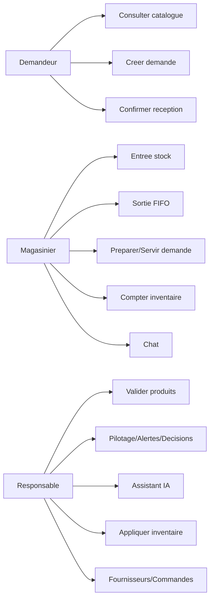

### 8.2 Diagramme de classes global (conceptuel)
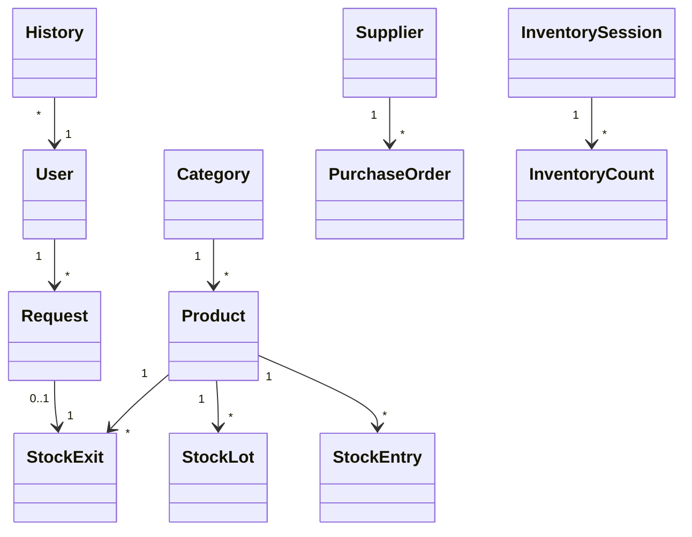

---

## 9) Backlog global + sprints (proposition)

Note: une version "max 5 sprints" avec diagrammes draw.io locaux est disponible dans `docs/SPRINTS_5_PLAN.md`.
Backlogs (global + par sprint): `docs/BACKLOG_5_SPRINTS.md`.
Version "format rapport (comme rapport00.pdf)": `docs/SPRINTS_5_RAPPORT_STYLE.md`.

### 9.1 Epics
1. Auth & securite (sessions, reset, RBAC, audit)
2. Catalogue & gouvernance produit (validation, categories, archivage)
3. Stock FIFO (entrees, lots, sorties, QR, bon interne)
4. Demandes & execution (workflow, notifications, reception)
5. Traçabilite & reporting (history, exports, security-audit)
6. Chat & collaboration (direct + threads)
7. Fournisseurs & commandes (PO, reception, liens produits)
8. Inventaires (comptage + application + ajustements)
9. IA & aide a la decision (predictions, copilote, assistant Responsable)

### 9.2 Roadmap "1 mois / 4 sprints" (coherent avec le doc IA)

Sprint 1 (Semaine 1) - Fondations & acces
- Login/refresh/sessions + RBAC + navigation roles
- Healthcheck + logs + audit securite de base
- Mise en place traces assistant (si focus IA)

Sprint 2 (Semaine 2) - Flux stock + demandes
- Catalogue demandeur + creation demande
- Preparation/service via sortie FIFO + lots
- Notifications + history

Sprint 3 (Semaine 3) - Pilotage responsable
- Validation produits + categories/audiences + seuils
- Copilote (decisions) + fournisseurs + commandes + reception
- Inventaires (lecture + preparation)

Sprint 4 (Semaine 4) - IA + qualite soutenance
- Assistant Responsable (chat/report + voix) + guardrails + traces
- Tests non regression + scenarios demo "petrole"

### 9.3 Detail par sprint (use cases + diagrammes)

#### Sprint 1 (Semaine 1) — Auth, sessions, acces

Sprint backlog (exemple)
- API: `/api/auth/login|refresh|logout|logout-refresh|logout-all`
- Sessions: `UserSession` + inactivite (backend) + refresh (frontend)
- RBAC: `PERMISSIONS` + `requirePermission`
- Exploitation: `/api/health`

Use case (texte): "Se connecter et ouvrir une session"
- Acteur: utilisateur
- Preconditions: compte actif
- Nominal: saisir identifiant+mdp -> token/refresh/session_id -> redirection home role
- Alternatives: credentials invalides / compte bloque / session expiree

Use case diagram (Sprint 1)
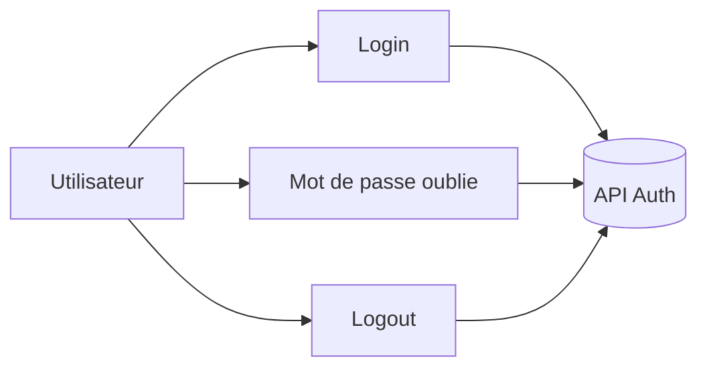

Sequence diagram (Sprint 1)
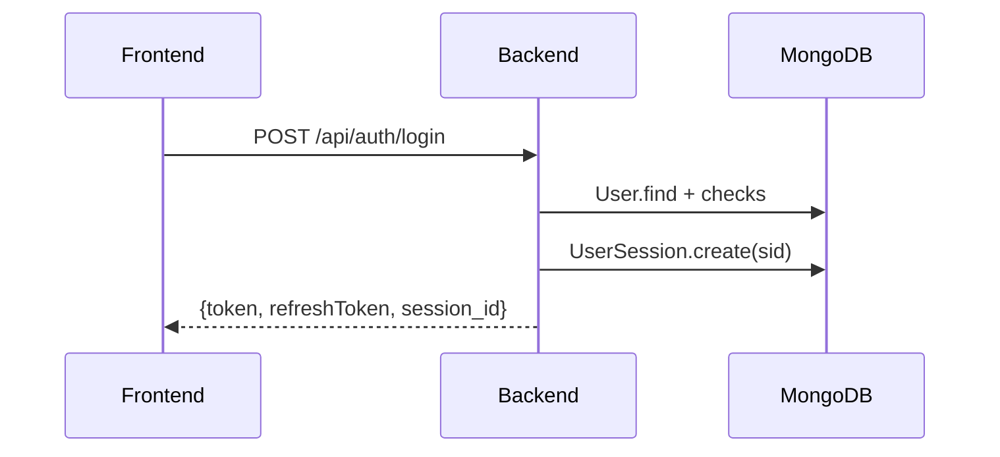

Activity diagram (Sprint 1)
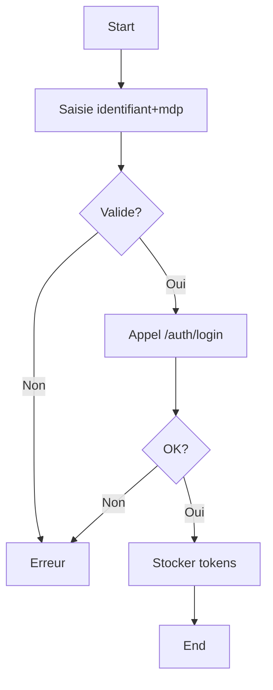

#### Sprint 2 (Semaine 2) — Demandes + FIFO

Sprint backlog (exemple)
- Demandeur: `GET /api/products` (approved) + `POST /api/requests`
- Magasinier: `PATCH /api/requests/:id/prepare` + `POST /api/stock/exits`
- FIFO: lots + audit QR (`FifoScanAudit`)
- Notifications + history

Use case (texte): "Servir une demande (FIFO)"
- Acteur: magasinier
- Preconditions: demande `validated/preparing`, stock OK, produit actif
- Nominal: preparer -> sortie FIFO -> demande `served` -> notif demandeur
- Exceptions: stock insuffisant / lot QR non conforme FIFO

Use case diagram (Sprint 2)
```mermaid
flowchart LR
  Dem[Demandeur] --> D1[Creer demande]
  Mag[Magasinier] --> D2[Preparer demande]
  Mag --> D3[Servir (sortie FIFO)]
  Dem --> D4[Confirmer reception]
```

Sequence diagram (Sprint 2)
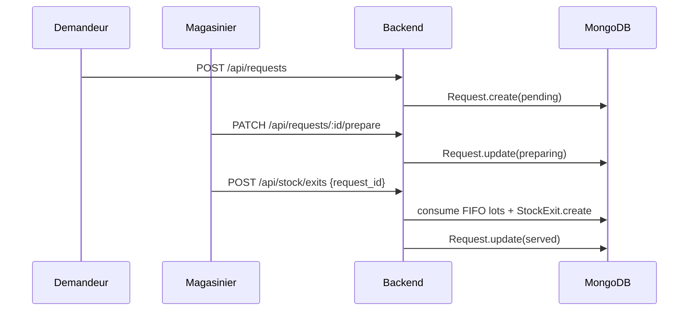

Activity diagram (Sprint 2)
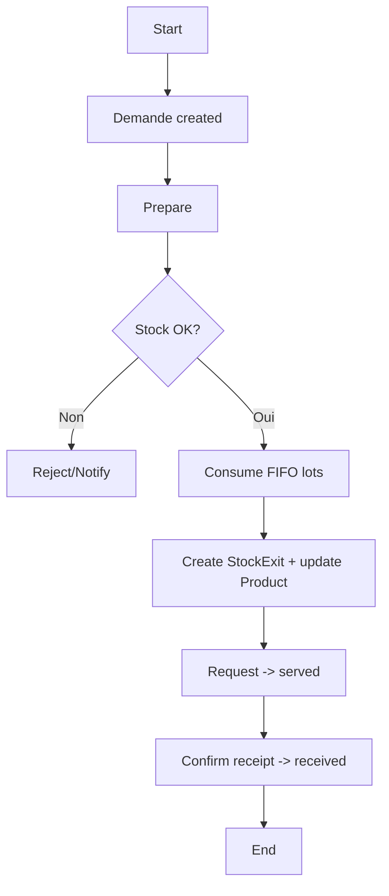

#### Sprint 3 (Semaine 3) — Pilotage + inventaires

Use case (texte): "Appliquer un inventaire cloture"
- Acteur: responsable
- Preconditions: session `closed`, comptages existants
- Nominal: appliquer -> ajustements entree/sortie -> stocks mis a jour -> History

Use case diagram (Sprint 3)
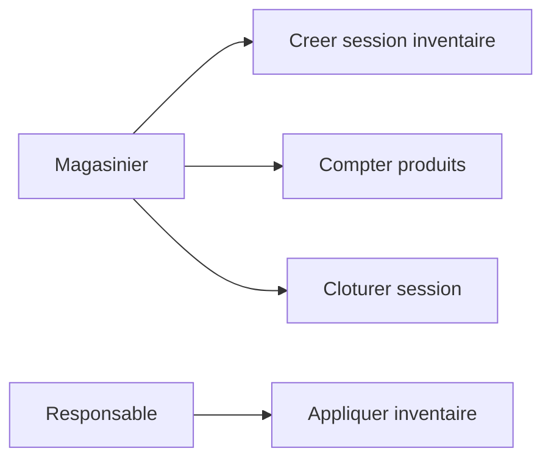

Sequence diagram (Sprint 3)
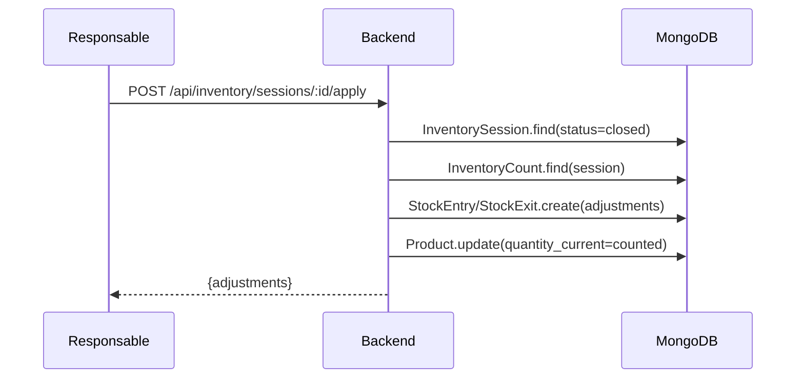

Activity diagram (Sprint 3)
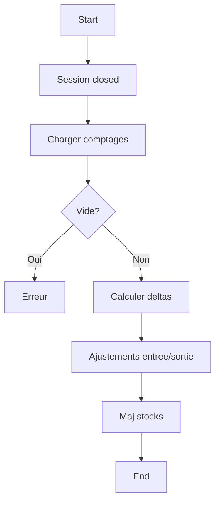

#### Sprint 4 (Semaine 4) — Assistant IA

Use case (texte): "Generer un mini-rapport hebdo"
- Acteur: responsable
- Nominal: mode report -> facts -> IA local -> Gemini (si dispo) -> trace -> affichage

Use case diagram (Sprint 4)
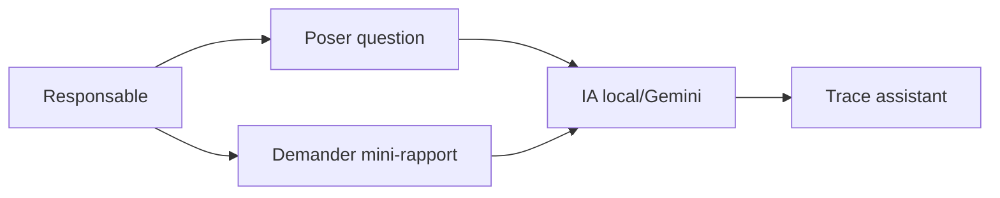

Sequence diagram (Sprint 4)
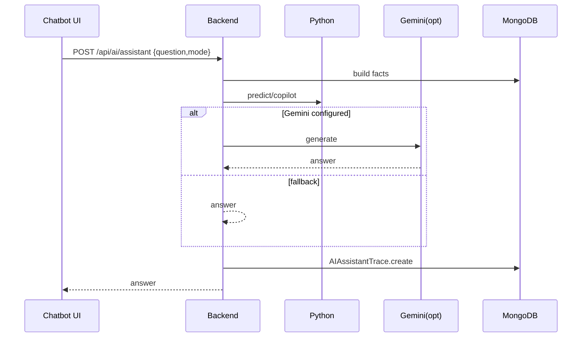

Activity diagram (Sprint 4)
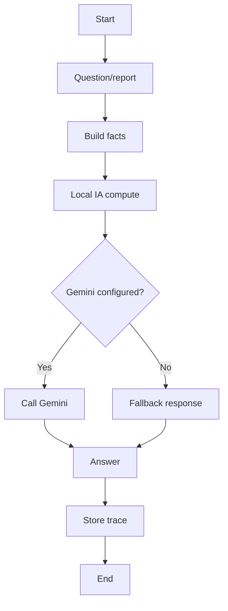

---

## 10) Contradictions / incoherences (rapport)

Un rapport detaille est fourni dans `docs/CONTRADICTIONS_REPORT.md`.

Synthese (top points):
- Inactivite: UI force un timeout local (~15 min) alors que le backend gere aussi une inactivite session (par defaut 2h) + access token 15 min -> risque de deconnexion prematuree cote UI.
- Pages "RoleSelection" / "ProtectedRoute": composants presents mais non utilises par le routage principal -> risque de divergence entre conception UI et comportement.
- Model `User`: schema sans `timestamps` (contrairement aux autres collections) + champs dates non uniformises (`date_creation`, `last_login` vs `createdAt/updatedAt`) -> risque de confusion reporting.
- Statuts demandes: presence de statuts legacy (`accepted/refused`) + statuts canoniques (`validated/rejected`) -> necessite une strategie de migration/normalisation (deja partiellement en place).
- Statut produit: "derive" de `quantity_current`/`seuil_minimum` mais presence d'etats bloquants (`bloque`, `archived`) -> attention aux fonctions qui recalculent le statut et peuvent ecraser un blocage si pas garde-fou.
