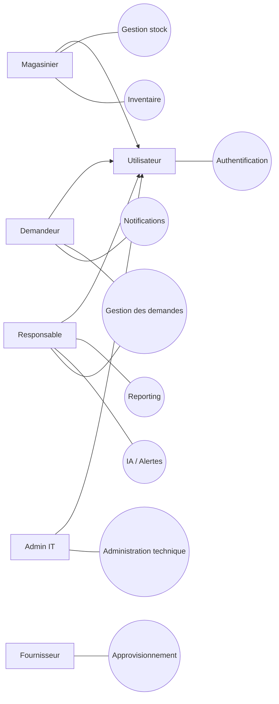

is## Check rapide — Fonctionnalités existantes (résumé)

### Acteurs
- Demandeur
- Magasinier
- Responsable
- Admin IT
- Fournisseur (optionnel / emails)

### Fonctionnalités réelles (dans l’app)
**Demandeur**
- S’authentifier / se déconnecter
- Consulter catalogue (filtré par profil)
- Créer demande
- Suivre demandes + notifications
- Paramètres (profil, email, notif)

**Magasinier**
- Voir demandes à traiter
- Préparer / servir une demande
- Entrée stock / Sortie stock
- QR code (scan/génération)
- Historique mouvements

**Responsable**
- Valider / refuser demandes
- Dashboard (KPIs + alertes IA)
- Pilotage (alertes, décisions)
- Fournisseurs (ranking + emails)
- Paramètres (règles stock + état IA)

**Admin IT**
- Supervision (health score + incidents)
- Maintenance
- Audit sécurité
- Gestion utilisateurs + sessions
- Support IT (notification + email)

**Fournisseur**
- Email de commande / relances (automatique ou manuel)

---

## Cas d’utilisation GLOBAL (macro)
(Ceux à mettre dans le diagramme global)

1. **Authentification**
2. **Gestion des demandes**
3. **Gestion du stock (entrées/sorties)**
4. **Inventaire**
5. **Alertes / IA**
6. **Reporting & Historique**
7. **Approvisionnement fournisseurs**
8. **Administration technique**
9. **Notifications**

---

## Tableau global (acteur → cas d’utilisation principaux)

| Acteur | Cas d’utilisation (macro) |
|---|---|
| Demandeur | Authentification, Catalogue, Créer demande, Suivre demandes, Notifications |
| Magasinier | Authentification, Préparer/Servir demande, Entrée stock, Sortie stock, QR code, Historique |
| Responsable | Authentification, Valider demandes, Pilotage/Alertes IA, Reporting, Fournisseurs |
| Admin IT | Authentification, Administration technique, Audit sécurité, Incidents, Sessions |
| Fournisseur (optionnel) | Réception commande (email), Confirmation livraison |

---

## Cas d’utilisation Admin IT (détaillés)
1. **S’authentifier**  
2. **Gérer utilisateurs** (créer / modifier / activer / désactiver)  
3. **Gérer sessions** (voir sessions actives, révoquer)  
4. **Consulter audit sécurité** (logs d’accès / erreurs)  
5. **Superviser incidents système** (erreurs, routes lentes)  
6. **Activer / désactiver maintenance**  
7. **Configurer paramètres techniques** (IA, limites runtime, policy emails)  
8. **Recevoir demandes Support IT** (email + notification)  

---

## Répartition par sprint (raffinement conseillé)

### Sprint 1 — Fondations & Auth
- S’authentifier / se déconnecter
- Gestion comptes & rôles (RBAC)
- Catalogue produit (lecture)
- Création de demande (Demandeur)

### Sprint 2 — Stock opérationnel
- Préparer / Servir demande (Magasinier)
- Entrée stock / Sortie stock
- QR code produit
- Historique des mouvements

### Sprint 3 — Pilotage Responsable
- Validation demandes
- Dashboard + indicateurs
- Pilotage (alertes, décisions)
- Notifications internes

### Sprint 4 — IA & Alertes
- Assistant IA
- Alertes IA (rupture/anomalie)
- Mini‑rapports

### Sprint 5 — Fournisseurs & Admin IT
- Fournisseurs (ranking, emails)
- Admin IT (maintenance, incidents, audit, sessions)
- Paramètres techniques (IA, gouvernance)

---

## Conseils de présentation
- **Diagramme global** : 8–9 cas max.
- **Diagrammes sprint** : détailler uniquement les cas du sprint.
- **Pas d’héritage dans paquetage** (seulement dans DCU).

---

## DCU global (Mermaid prêt)
Colle dans draw.io → Arrange → Insert → Advanced → Mermaid

